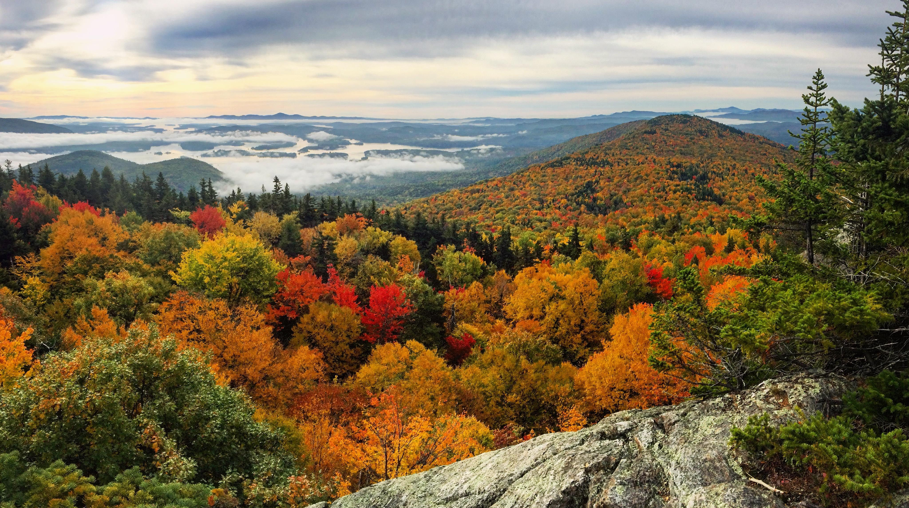
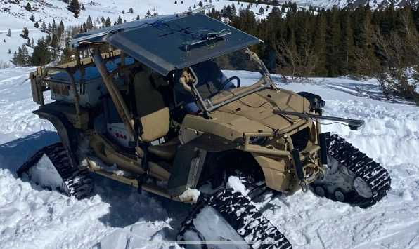
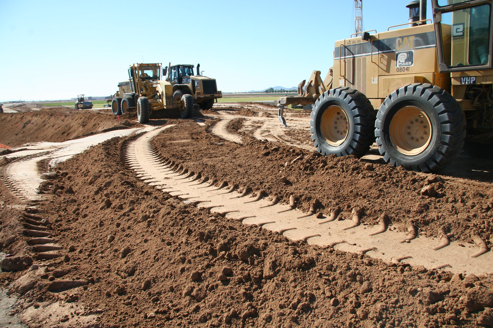

# 55th Conference of the International Society for Terrain-Vehicle Systems

The 55th Conference of the International Society for Terrain-Vehicle Systems (ISTVS) is an opportunity to present and disseminate the latest scientific and technological achievements in the field of vehicle-terrain systems.

Representatives of science in the fields of mechanical engineering, vehicles and machines, robotics and automation, soil science, civil engineering, agricultural engineering, environmental engineering, as well as professionals from industry, academia and government agencies are invited to participate. The organizers particularly welcome participation of students from under- and postgraduate courses.

<figure><figcaption></figcaption></figure>

<figure><figcaption></figcaption></figure>

The intention of the organizers is to create a friendly atmosphere and comfortable conditions for holding plenary sessions. The conference includes the following thematic tracks:

* Innovative concepts in tires, wheels, tracks, and other ground contact elements&#x20;
* Propulsion systems and vehicle electrification
* Creative terrain mechanical characterization and deformation modeling
* Advances in off-road mobility modeling
* Off-road autonomy, robotics and navigation
* New instrumentation and analysis methods in terramechanics testing
* Climate impacts on terrain, terramechanics, and off-road vehicles
* International collaborations

<figure><figcaption></figcaption></figure> <figure><figcaption></figcaption></figure>

