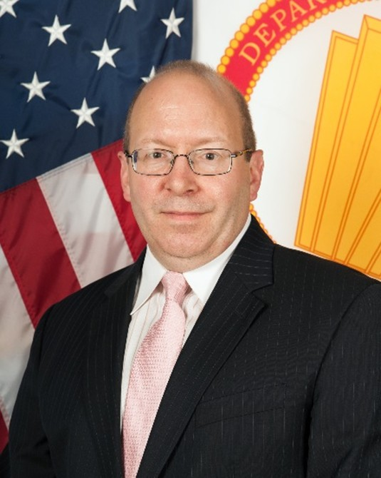
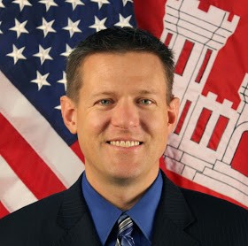

# Keynote

## Dr. David J. Gorsich

#### _Chief Scientist, U.S. Army Ground Vehicle Systems Center_

Keynot&#x65;_:_ **Off-road Ground Vehicle Mobility and Assessment**

<figure><figcaption>
Dr. David J. Gorsich, United States Army Ground Vehicle Systems Center
</figcaption></figure>

Dr. David J. Gorsich is the U.S. Army Chief Scientist for Ground Systems at the U.S. Army
\
Futures Command, Combat Capabilities Development Command (CCDC) - Ground Vehicle
\
Systems Center (GVSC), a $1.4B/year organization with 3000 employees. He is the Army
\
Senior Research Scientist (ST) in Modeling and Simulation / Digital Engineering with a M.S.
\
degree from George Washington University, and a Ph.D. from M.I.T. in Applied Mathematics.
\
Dr. Gorsich is currently on a special assignment with the Deputy Assistant Secretary of the
\
Army for Data, Engineering and Software where he developed the Digital Engineering Strategy
\
for the Army. He is a Fellow of the Society of Automotive Engineers (SAE) and the American
\
Society of Mechanical Engineers (ASME). He is the U.S. lead for the S\&T Applied Vehicle
\
Technology Panel under NATO. He is also the Army ground lead for the TTCP Land Group.
\
He leads the GVSC basic research program, engagement with academia, and development of
\
technical staff. He currently leads the development of modeling and simulation (M\&S) tools for
\
the development and assessment of autonomous ground systems. In the past he led the
\
development and validation of underbody blast M\&S tools of ground systems. These tools were
\
used to redesign many of the U.S. Army’s combat and tactical vehicles. He also developed new
\
reliability-based design methods used to assess the reliability of ground systems, and co-led the
\
validation, fielding and use of such methods in the Army. Dr. Gorsich was the associate editor
\
of the ASME journal of mechanical design from 2009-2015. He is currently the editor-in-chief
\
for the Journal of Terramechanics and the Journal of Autonomous Vehicles and Systems. He
\
has over 200 peer-reviewed journal articles with 4300 citations and an h-index of 31. He has been
\
a visiting scholar and adjunct professor at numerous universities. His current research interests
\
are digital engineering, machine learning, terramechanics, assessment of mobility and
\
maneuver, and autonomy.

***

## Dr. Paul van Susante

#### _Assistant Professor at Michigan Technological University, holder of the Lou & Herbert Wacker professorship in Mechanical Engineering, department of Mechanical and Aerospace Engineering and Affiliate Assistant Professor in the Civil, Environmental and Geospatial Engineering department_

<figure><figcaption>
Dr. Paul van Susante, Michigan Technological University
</figcaption></figure>

Dr. van Susante is an endowed assistant professor at Michigan Technological University in the Mechanical and Aerospace Engineering Department and the founder and PI of the Planetary Surface Technology Development Lab (PSTDL), also known as HuskyWorks. Dr. van Susante’s research focuses on robotic systems for In-Situ Resource Utilization (ISRU) and construction and in particular, robotic mechanical systems under lunar and mars conditions interacting with the lunar and Mars surface. He is actively researching, developing and testing technologies under lunar and mars environmental conditions for detecting volatiles in lunar regolith, determining geotechnical properties of lunar regolith, excavating, conveying and compacting (icy, cemented) lunar regolith, excavating (cemented) lunar regolith, excavating gypsum and extracting water from excavated gypsum and buried glaciers for Mars applications as well as developing power transfer via (superconducting) tether into the lunar Permanently Shade Regions. Dr. van Susante is PI on multiple NASA and industry funded ISRU projects with a combined value of over $5.6M. More information can be found at [https://www.huskyworks.space](https://www.huskyworks.space)

***

## Dr. John B. Eylander

#### _Research Physical Scientist, Hydrologic Systems Branch, Coastal and Hydraulic Laboratory, U.S. Army Engineer Research and Development Center_

<figure><figcaption>
Dr. John B. Eylander, Coastal and Hydraulic Laboratory, U.S. Army Engineer Research and Development Center
</figcaption></figure>

Dr. Eylander is a research physical scientist with expertise in developing and managing interdisciplinary research and development programs that integrate weather and terrain data into decision support systems.  Dr. Eylander’s technical background is focused on weather, surface hydrology, land surface modeling, land-atmosphere interactions, high performance computing and satellite remote sensing.  Dr. Eylander has lead numerous multi-organization research initiatives, supports end-users across the U.S. Government and works with military and non-military groups supporting weather effects on trafficability and international diplomacy on transboundary hydrology.  The interagency and interdisciplinary collaborations has resulted in the development, and integration of award winning numerical modeling and decision support software such as the NASA-USAF-ERDC Land Information System hydrometeorological modeling and data assimilation framework, the Geospatial Weather Affected Terrain Conditions and Hazards application.  Dr. Eylander’s collaborates with researchers across multiple US Government organizations, including NASA, NOAA, NSF, and USGS, multiple academic institutions, private sector companies, the national intelligence community, and across military services.  John is a member of several national and international committees and collaborates internationally on technical aspects of land data assimilation and hydrologic modeling.&#x20;

Prior to joining ERDC, Dr. Eylander was the Chief Technology Officer for the formerly named Air Force Weather Agency (AFWA; now 557th Weather Wing) 16th Weather Squadron, serving as the lead technical expert for AFWA’s numerical weather prediction system, and leading strategic development and integration of NASA’s Land Information System into AFWA operations and AFWA’s $200M cloud analysis and prediction system, the Cloud Depiction and Forecast System-Version II.  Prior to working for AFWA, Dr. Eylander supported NASA Goddard Space Flight Center Sea Ice climate research team.
