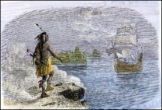
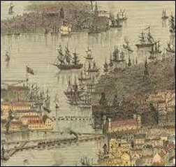
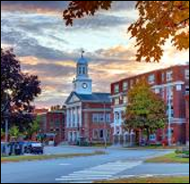
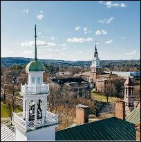
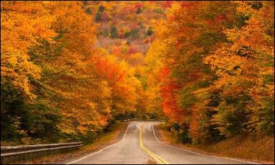
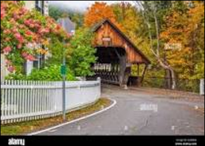
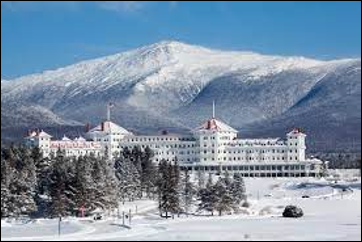
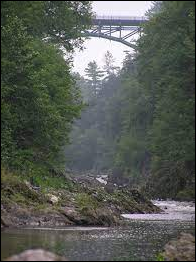
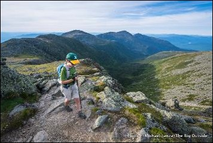

# Location

Conference held in beautiful and historic New England during the height of the fall foliage season.

<figure><figcaption>
Arrival
</figcaption></figure>

<figure><figcaption>
Early Boston, Massachusetts
</figcaption></figure>

<figure><figcaption>
Lebanon, New Hampshire
</figcaption></figure>

 

<figure><figcaption>
Hanover, New Hampshire
</figcaption></figure>

<figure><figcaption>
Fall foliage — <a href="https://www.visitnh.gov/seasonal-trips/fall/foliage-tracker">https://www.visitnh.gov/seasonal-trips/fall/foliage-tracker</a>
</figcaption></figure>

<figure><figcaption>
Woodstock—quaint, shopping, restaurants, covered bridges
</figcaption></figure>

<figure><figcaption>
Mount Washington—historic hotels, cog railway, weather station
</figcaption></figure>

<figure><figcaption>
Quechee Gorge—nature, glass blowing, Shackleton furniture makers, world-class restaurants
</figcaption></figure>

<figure><figcaption>
Outdoor activities—kayaking, hiking, Appalachian trail, fishing
</figcaption></figure>

