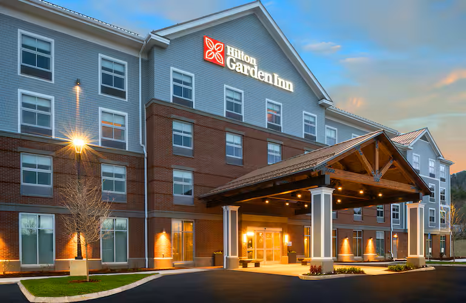
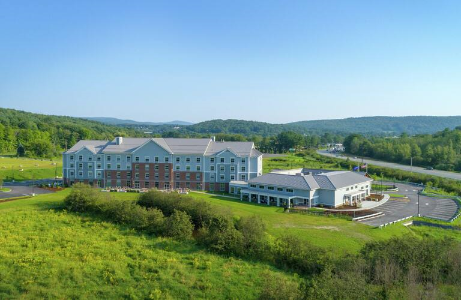
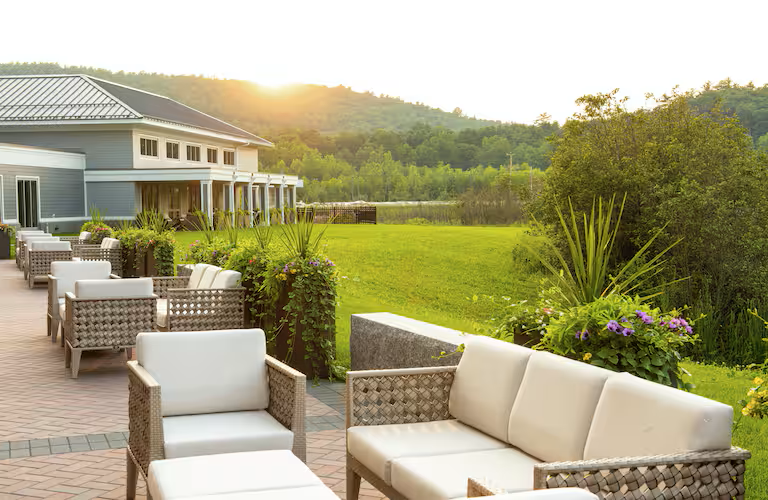
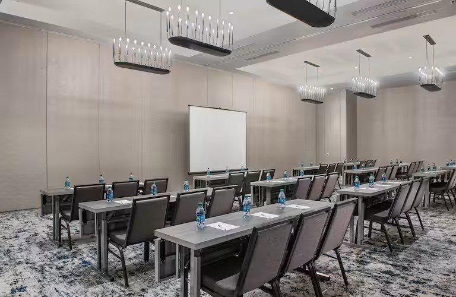

# Location

This year's conference will be held in beautiful and historic New England during the height of the fall foliage season.

***

The conference will be hosted at the [Hilton Garden Inn, Lebanon, NH USA](https://www.hilton.com/en/hotels/lebhagi-hilton-garden-inn-hanover-lebanon).

<figure><figcaption></figcaption></figure>

<figure><figcaption></figcaption></figure>

 

<figure><figcaption></figcaption></figure>

<figure><figcaption></figcaption></figure>

***

<table data-view="cards"><thead><tr><th></th><th></th><th></th><th data-hidden data-card-cover data-type="files"></th></tr></thead><tbody><tr><td>Lebanon Opera House</td><td><em>Lebanon, NH</em></td><td></td><td><a href="../.gitbook/assets/LebOperaHouse.jpg">LebOperaHouse.jpg</a></td></tr><tr><td>Charles River</td><td><em>Boston, MA</em></td><td></td><td><a href="../.gitbook/assets/Boston.jpg">Boston.jpg</a></td></tr><tr><td>Cog Railway</td><td><em>Mount Washington, NH</em></td><td></td><td><a href="../.gitbook/assets/Mount_Washington_Cog_Railway_Fall.jpg">Mount_Washington_Cog_Railway_Fall.jpg</a></td></tr><tr><td>Green Mountains</td><td><em>Smuggler's Notch Jeffersonville, VT</em></td><td></td><td><a href="../.gitbook/assets/Smugglers_Notch(fromSouth).jpg">Smugglers_Notch(fromSouth).jpg</a></td></tr><tr><td>Old State House</td><td><em>Boston, MA</em></td><td></td><td><a href="../.gitbook/assets/Old_State_House,_Washington_St,_Boston_(493457)_(10773321993).jpg">Old_State_House,_Washington_St,_Boston_(493457)_(10773321993).jpg</a></td></tr><tr><td>Dartmouth College</td><td><em>Hanover, NH</em></td><td></td><td><a href="../.gitbook/assets/Baker-Library-Dartmouth-College-New-Hanover-Hampshire-05-2018b.jpg">Baker-Library-Dartmouth-College-New-Hanover-Hampshire-05-2018b.jpg</a></td></tr><tr><td>White River Station</td><td><em>White River Junction, VT</em></td><td></td><td><a href="../.gitbook/assets/White_River_Junction_VT.jpg">White_River_Junction_VT.jpg</a></td></tr><tr><td>Crawford Notch</td><td><em>Hart's Location, NH</em></td><td></td><td><a href="../.gitbook/assets/Crawford_Notch.jpg">Crawford_Notch.jpg</a></td></tr><tr><td>Pinkham Notch</td><td><em>Gorham, NH</em></td><td></td><td><a href="../.gitbook/assets/Pinkham_Notch.jpg">Pinkham_Notch.jpg</a></td></tr><tr><td>Poverty Lane Orchard</td><td><em>Lebanon, NH</em></td><td></td><td><a href="../.gitbook/assets/Pverty_Lane_Orchard.jpg">Pverty_Lane_Orchard.jpg</a></td></tr><tr><td>Tugboats at harbor</td><td><em>Portsmouth, NH</em></td><td></td><td><a href="../.gitbook/assets/Tugboats_Portsmouth.jpg">Tugboats_Portsmouth.jpg</a></td></tr><tr><td>Church Street</td><td><em>Burlington, VT</em></td><td></td><td><a href="../.gitbook/assets/Church_Street.jpg">Church_Street.jpg</a></td></tr></tbody></table>

### _Image Citations:_

(from left)

1. [https://www.flickr.com/photos/dougtone/5956178815/in/photostream/](https://www.flickr.com/photos/dougtone/5956178815/in/photostream/)
2. [https://commons.wikimedia.org/wiki/File:Boston\_Skyline\_Over\_the\_Charles\_River.jpg](https://commons.wikimedia.org/wiki/File:Boston\_Skyline\_Over\_the\_Charles\_River.jpg)
3. [https://commons.wikimedia.org/wiki/File:Mount\_Washington\_Cog\_Railway\_Fall.jpg](https://commons.wikimedia.org/wiki/File:Mount\_Washington\_Cog\_Railway\_Fall.jpg)
4. [https://commons.wikimedia.org/wiki/File:Smugglers\_Notch(fromSouth).jpg](https://commons.wikimedia.org/wiki/File:Smugglers\_Notch\(fromSouth\).jpg)
5. [https://commons.wikimedia.org/wiki/File:Old\_State\_House,\_Washington\_St,\_Boston\_(493457)\_(10773321993).jpg](https://commons.wikimedia.org/wiki/File:Old\_State\_House,\_Washington\_St,\_Boston\_\(493457\)\_\(10773321993\).jpg)
6. [https://commons.wikimedia.org/wiki/File:Baker-Library-Dartmouth-College-New-Hanover-Hampshire-05-2018b.jpg](https://commons.wikimedia.org/wiki/File:Baker-Library-Dartmouth-College-New-Hanover-Hampshire-05-2018b.jpg)
7. [https://commons.wikimedia.org/wiki/File:White\_River\_Junction\_VT.jpg](https://commons.wikimedia.org/wiki/File:White\_River\_Junction\_VT.jpg)
8. [https://www.flickr.com/photos/84263554@N00/2953683126](https://www.flickr.com/photos/84263554@N00/2953683126)
9. [https://www.flickr.com/photos/bfs\_man/8072478328](https://www.flickr.com/photos/bfs\_man/8072478328)
10. [https://www.flickr.com/photos/mr\_t\_in\_dc/5188907658](https://www.flickr.com/photos/mr\_t\_in\_dc/5188907658)
11. [https://pxhere.com/en/photo/984327](https://pxhere.com/en/photo/984327)

[Front page image New Hampshire Foliage](https://www.reddit.com/media?url=https%3A%2F%2Fi.redd.it%2F2398ktgw9cqx.jpg\&rdt=59350)
