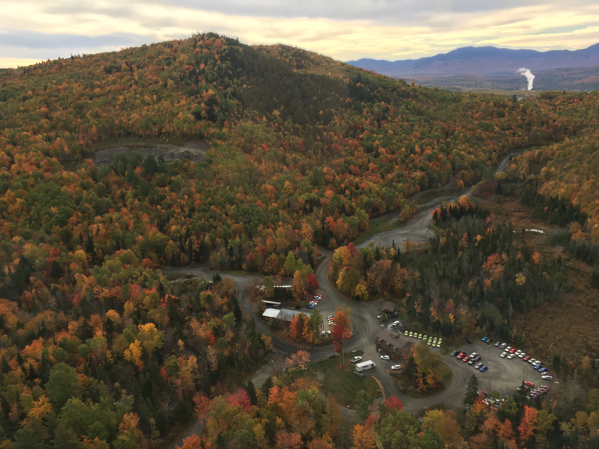
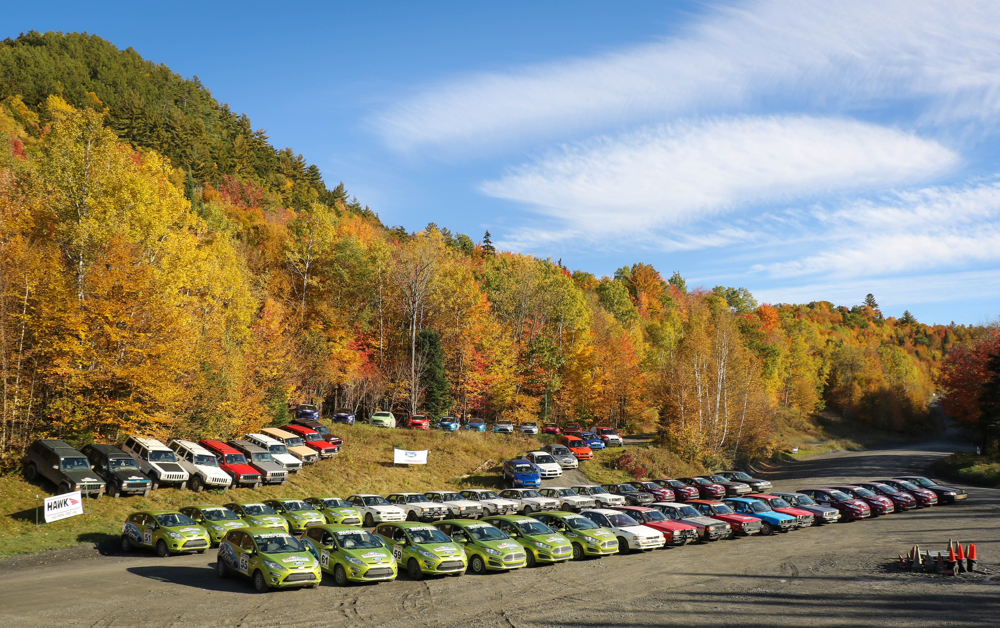
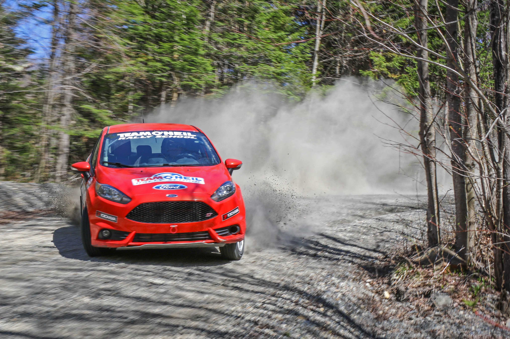
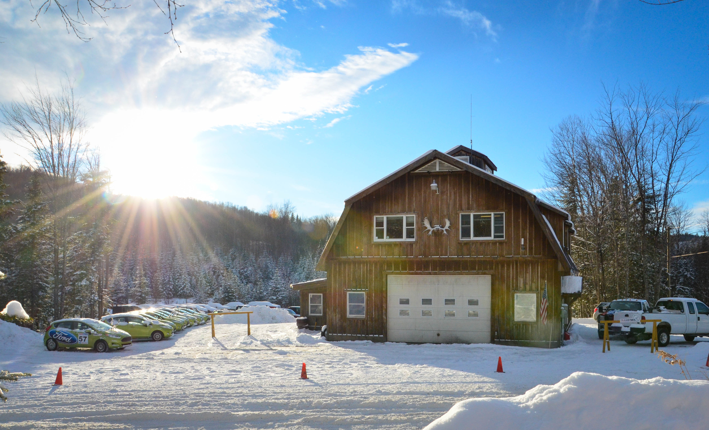

# Team O'Neil Rally School Tour

<figure><figcaption>
Team O'Neil's facility in Dalton, NH
</figcaption></figure>

<figure><figcaption>
Team O'Neil's Fleet Vehicles
</figcaption></figure>

### About

Team O'Neil is the world leader in advanced vehicle control driver training on all road surfaces. Take a tour of Team O'Neil's 600-acre headquarters facility in Dalton, NH and NH's scenic White Mountains. You will see their fleet of vehicles, be taken on a tour of the property, and meet the instructors that train drivers from all over the world in rally driving techniques. Guests will potentially see students conducting training and maybe even get a ride in a rally car. Exact details will be dependent on training being conducted that day, but Team O'Neil will try to accomodate as much activity as possible.

_Two tour times are available. The tour will last about 2 hours. There will be no cost for the tour, but space will be limited!_

### Date & Time

* Friday, October 10
* Two time slots are available to choose:
  * 1000 - 1200
  * 1400 - 1600

### Visual Highlights: A Look Through the Lens

<figure><figcaption>
TON Sign Map
</figcaption></figure>

<figure><figcaption>
Vehicles in motion demonstration
</figcaption></figure>

<figure><figcaption>
Vehicles in motion demonstration
</figcaption></figure>

<figure><figcaption>
Facility in the winter
</figcaption></figure>

