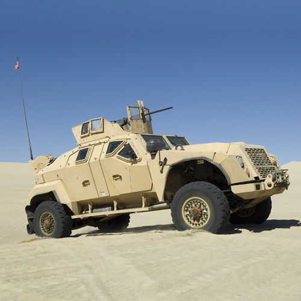
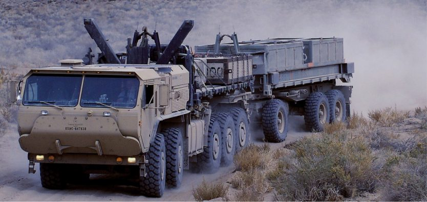

# Meet NATC

<figure><figcaption>
The Future of Automotive Testing
</figcaption></figure>

Founded in 1957, NATC is a privately owned, independent test, evaluation, design, and engineering facility offering development and certification testing to customers worldwide. We have provided services for more than 1,000 vehicle systems and components for automotive, commercial, construction, military, and public utility applications, and we have logged more than 50 million test miles and advanced the state of the art in test procedures, data acquisition, and analysis.

Successful production of a new car, truck, bus, or component depends on teamwork to meet customer expectations. We have spent over 60 years developing partnerships with our customers. Our divisions are dedicated to providing value-added technical solutions to the worldwide transportation industry. Our substantial international experience, allows us to evaluate products intended for global markets knowledgeably and objectively. We have compiled an extensive database of worldwide operational and infrastructure conditions allowing accurate definition of user duty cycles and creation of test programs that are representative of service environments around the world.

Along with worldwide duty cycles, data acquisition, and advanced engineering analysis, we provide complete prototype fabrication capabilities for one-stop solutions from design to product verification.

Between our four locations, we have the experience to cover all your engineering and testing needs.

<figure><figcaption></figcaption></figure> <figure><figcaption></figcaption></figure>

