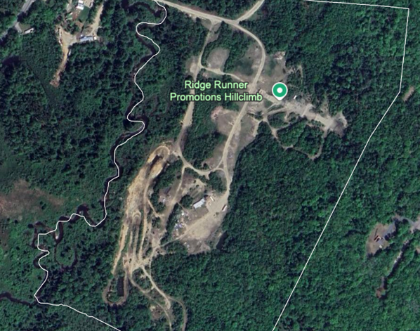
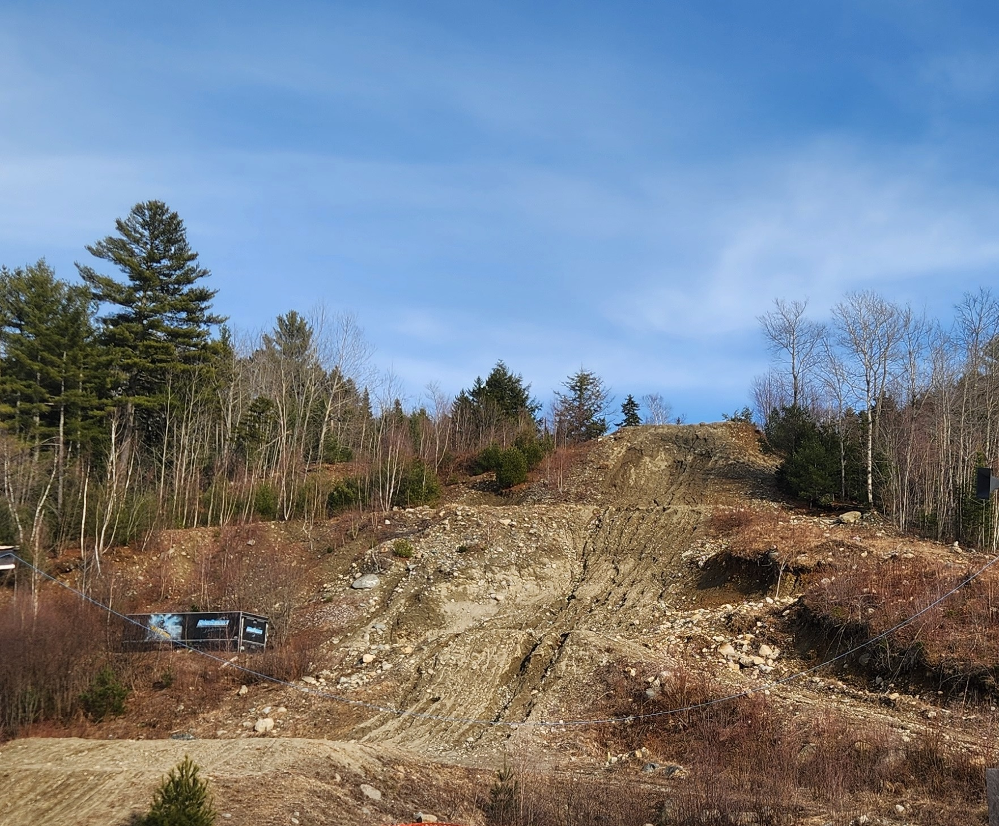
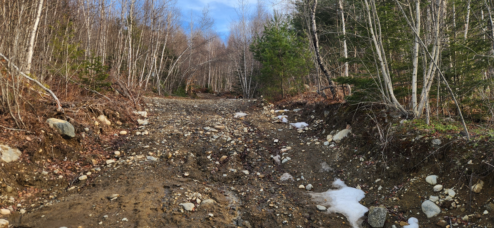
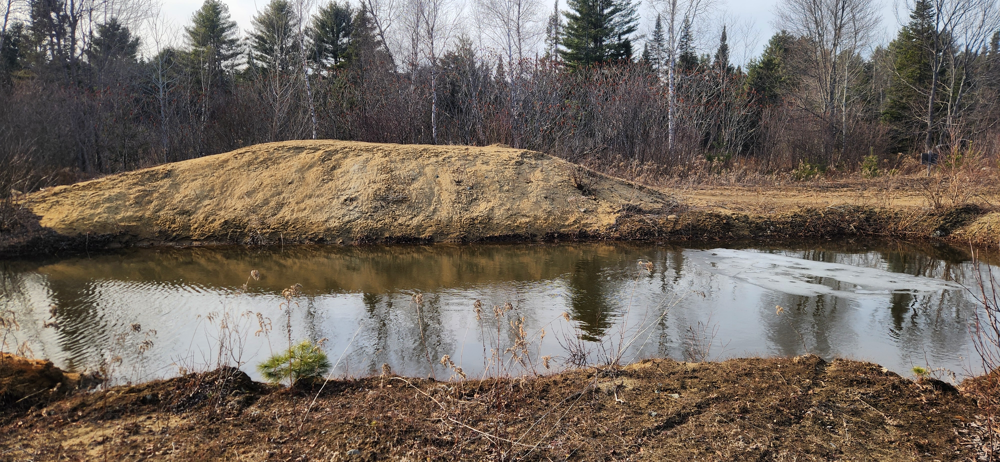
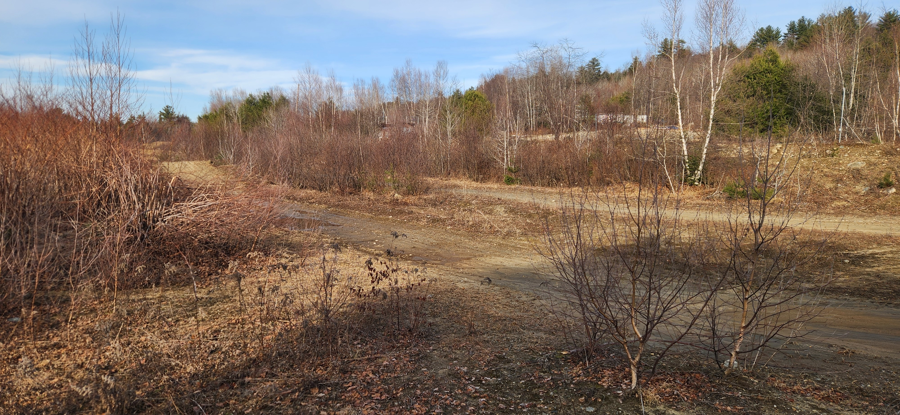
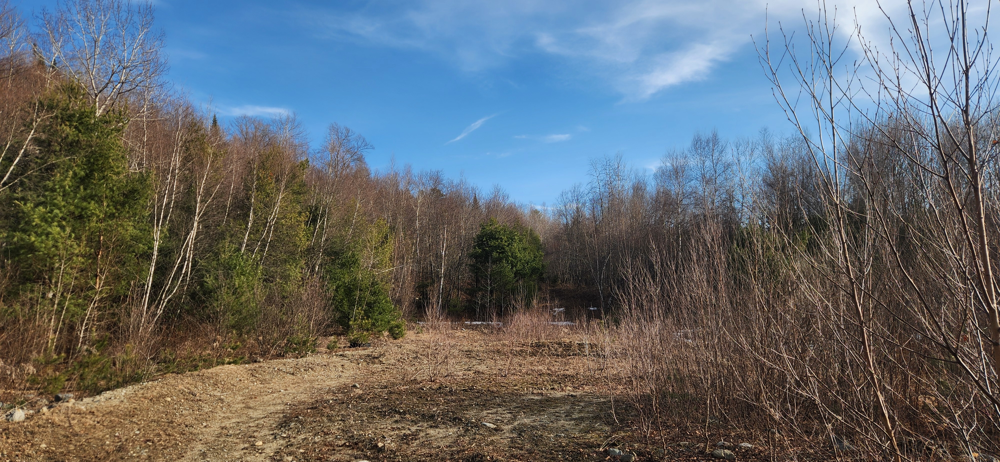

# Autonomy Demonstration

Off-road vehicle autonomy faces unique challenges due to the unpredictable nature of off-road environments. Advancing modeling, estimation, and control methodologies for both subsystems and systems is key to unlocking the potential of autonomous off-road vehicles. These technologies have applications in sectors like agriculture, mining, construction, and defense. The upcoming demonstration (Wednesday) and workshop (Friday) aim to bring together the autonomous vehicle community to explore technical challenges, showcase promising directions, and discuss future opportunities. The event will feature four or five teams showcasing different off-road navigation approaches, with the workshop summarizing the demonstration for future research discussions and publications.

### Ridge Runner Demonstrations

<figure><figcaption>
Ridge Runner Courses
</figcaption></figure> <figure><figcaption>
The Ridge
</figcaption></figure>

The Ridge Runner course is a more extreme example of off road mobility. This demonstration will be high-speed driving in rugged conditions, on asphalt, over gravel, and through winter weather affected terrain. These conditions are excellent for pushing vehicles to their theoretical limitations. This demonstration will include a discussion on how this applies to off road mobility and the many challenges of autonomy in these conditions.

<figure><figcaption>
Complex, off-road conditions
</figcaption></figure> <figure><figcaption>
Water Obstacle
</figcaption></figure>

<figure><figcaption>
Narrow, winding paths
</figcaption></figure> <figure><figcaption>
Close Corners
</figcaption></figure>

The Autonomy workshop will be held on Friday to discuss the demonstrations and define the key needs and questions related to autonomy. The results of the workshop will be presented in a publication in the Journal of Terramechanics. The Autonomy workshop on Friday is co-organized by GVSC and will be held at the CRREL auditorium so _**will require**_ [_**registration**_ ](../../registration.md)_**but is**_ _**free of charge.**_

### [Autonomy Workshop](../post-conference-events/#post-conference-autonomy-workshop) 

The Autonomy workshop will be held on Friday to discuss the demonstrations and define the key needs and questions related to autonomy. The results of the workshop will be presented in a publication in the Journal of Terramechanics. The Autonomy workshop on Friday is co-organized by GVSC and will be held at the CRREL auditorium so _**will require**_ [_**registration**_ ](../../registration.md)_**but is**_ _**free of charge.**_
