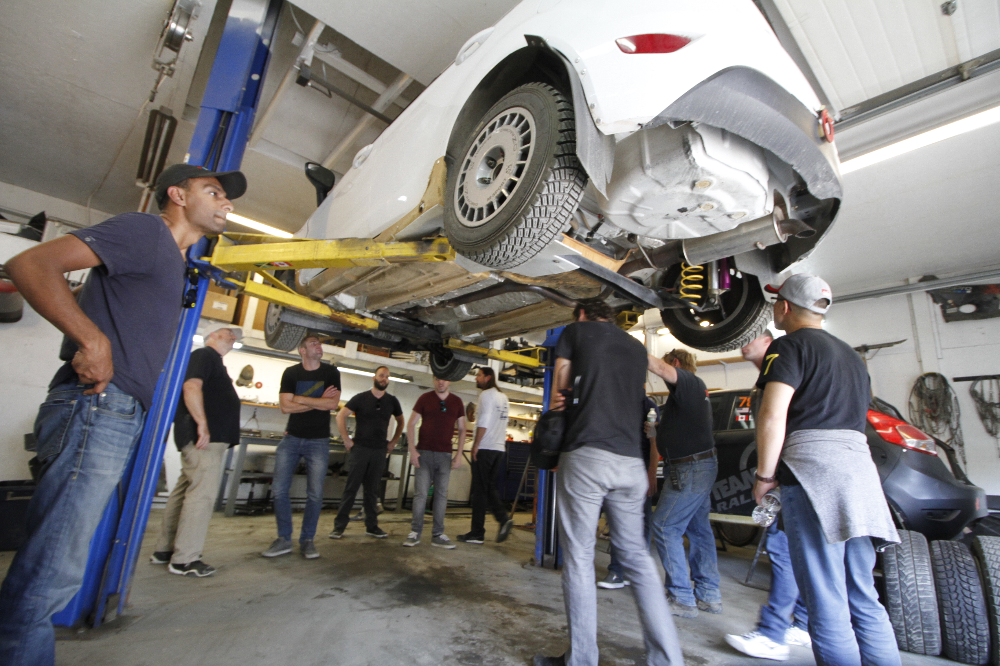

# Team O’Neil Rally Demonstrations

<figure><figcaption>
Canaan Asphalt Rally
</figcaption></figure>

Multi-time rally champions Team O'Neil and North American Rally champion Travis Hansen will demonstrate vehicle dynamics and soft soil mobility. There will be a static display and introduction to Rally cars and their modifications for high-speed, paved and unpaved-road performance.

Included is a ride-along asphalt rally experience (1 to 3 per vehicle, depending on number of participants and schedule).

<figure><figcaption></figcaption></figure>

<figure><figcaption></figcaption></figure> <figure><figcaption></figcaption></figure>

<figure><figcaption></figcaption></figure>
