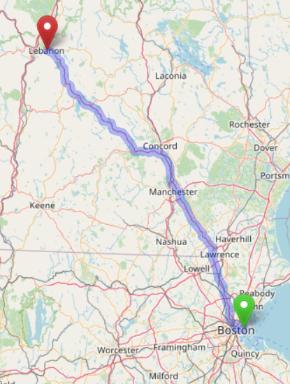

# Transportation

<figure><figcaption></figcaption></figure>

## Airports within a 2+ hour drive&#x20;

**BOS** | Logan International Airport, Boston, Massachusetts; major international airport with direct flights from many countries

**MHT** | Manchester-Boston Regional Airport, Manchester, NH. 1.5 hr drive

**LEB** | Lebanon Municipal Airport, Lebanon, New Hampshire; serviced by Cape Air with 4 flights/day to BOS

**BTV** | Burlington International Airport, Burlington, Vermont

**BDL** | Bradley International Airport, Windsor Locks, Connecticut

***

## Direct coach to Lebanon, NH

Dartmouth Coach from all BOS terminals to Lebanon, New Hampshire; 11 times/day, 2 hr, $70 round trip\
Dartmouth Coach from NYC (midtown) to Lebanon, New Hampshire; 3 times/day\
[dartmouthcoach.com](https://dartmouthcoach.com)

***

## Rental cars

All major rental car companies from BOS; most major rental car companies in MHT; Avis and Enterprise in Lebanon, NH
